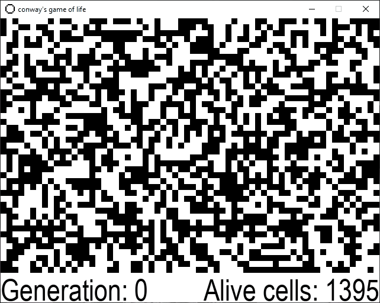

# Conway's Game of Life

My PyGame implementation of Conway's Game of Life.

## Sections

1. [Presentation](#presentation)
2. [Configuration](#configuration)
3. [Running](#running)
4. [Controls](#controls)

## Presentation

## Configuration

You could change game speed by editing the parameter value in the .bat file which is:

      --max_fps 30

<b>(It overrides the constructor max_fps argument)</b>

 If you want to edit more settings - you need to enter arguments into the <b>GameOfLife()</b> constructor. You can
do this in the <b>__main__.py</b> file.
 Here are the arguments it takes by default:

      screen_width=640,
      screen_height=480, 
      menu_height=50, 
      cell_size=10, 
      dead_color=(255, 255, 255),
      alive_color=(0, 0, 0), 
      max_fps=30

## Running

1. If you are using <b>Python launcher</b>
    - Install PyGame via CMD using:

            py -m pip install pygame

    - Then simply run the game by launching:

            gameoflife.bat

2. If you are using <b>Python executable</b>
    - Install PyGame via CMD using:

            pip install pygame
            
            or

            python -m pip install pygame

    - Then you need to edit the .bat file. This is what you need to enter:

            @python instead of @py

    - Then simply run the game by launching:

            gameoflife.bat

## Controls

- p - to toggle start/stop (pause)
- r - to randomize the grid
- n - display next generation
- c - clear grid
- q - to quit the game
- LMB - pressed or held sets cell alive
- RMB - pressed or held sets cell dead